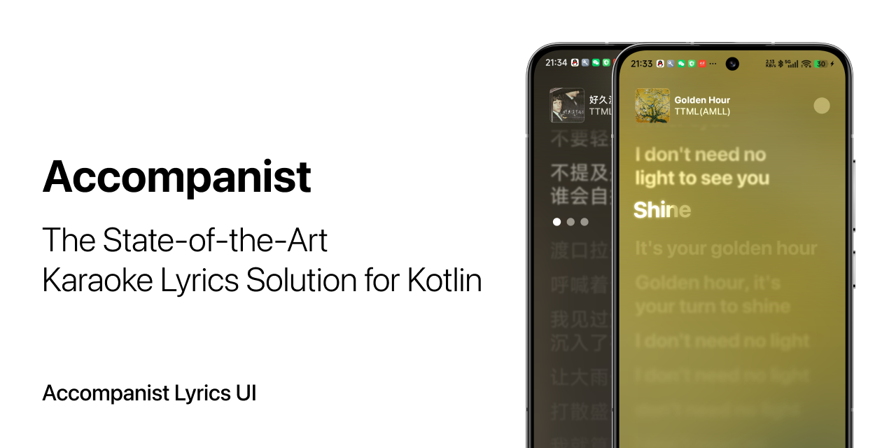

[](https://github.com/6xingyv/Accompanist/releases/latest)
[](https://central.sonatype.com/artifact/com.mocharealm.accompanist/lyrics-ui)
[](https://t.me/mocha_pot)

## 📦 Repository

Accompanist released a group of artifacts, including: 

- [`lyrics-core`](https://github.com/6xingyv/Accompanist-Lyrics) - Parsing lyrics file, holding data and exporting to other formats.

- [`lyrics-ui`](https://github.com/6xingyv/Accompanist) - Standard lyrics interface built on Jetpack Compose

This repository hosts the `lyrics-ui` code.

## ✨ Features

- **🌈 Dynamic Gradient Highlighting**: Beautify active lyric lines with fully customizable, animated gradient brushes for a stunning visual effect.

- **🎤 Multi-Voice & Duet Support**: Effortlessly manage and display lyrics for multiple singers, perfect for duets and choral pieces.

- **🎨 Precision Text Animation**: Achieve classic karaoke-style highlighting with frame-perfect timing.

- **🎶 Accompaniment Line Support**: Intelligently separates and styles main vocals from accompaniment or background lines.

- **⚡️ High-Performance Rendering**: Engineered for buttery-smooth animations and low overhead, ensuring a great user experience even on complex lyrics.

## 🚀 Installation

Add the dependency to your `build.gradle.kts`:

```kotlin
dependencies {
    implementation("com.mocharealm.accompanist:lyrics-ui:VERSION")
}
```

*Replace `VERSION` with the latest version from Maven Central.*

## ✅ Todo

- [ ] Spring animations for `LazyList` items when scrolling
- [ ] Extract animation parameters from `KaraokeLineText`
- [ ] More precise animation parameters from Apple
- [ ] Mesh gradient/Image distortion `FlowingLightBackground` animation

## 🤝 Contributing

Contributions are welcome! Please feel free to submit a pull request or open an issue to discuss your ideas. For major changes, please open an issue first.


## 📜 License

This project is licensed under the **Apache License 2.0**. See the [LICENSE](http://www.apache.org/licenses/LICENSE-2.0.txt) file for details.